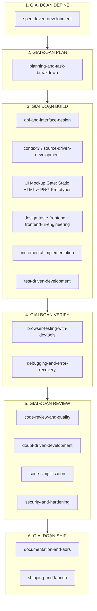

# Quy Trình Điều Phối Agent & Lộ Trình Triển Khai (Agent Skill Flow & Roadmap)

Tài liệu này định nghĩa quy trình làm việc chuẩn (**Skill-driven Lifecycle**) và lộ trình thực thi từng bước để xây dựng hệ thống **Video Teaching Research** dựa trên đặc tả trong [starter-prompt.md](file:///Users/mac/Documents/Personal/Projects/video-teaching-research/docs/starter-prompt.md).

---

## 1. Skill Flow Tổng Quan

---

## 2. Chi Tiết Các Chặng & Trách Nhiệm Của Từng Skill

### Chặng 1: DEFINE *(Đã hoàn thành)*
* **`spec-driven-development`**: Hoàn thiện và đóng băng đặc tả yêu cầu, luồng dữ liệu (Data Flow), cấu trúc schema DB và logic nghiên cứu trong [docs/specs/starter-prompt.md](file:///Users/mac/Documents/Personal/Projects/video-teaching-research/docs/specs/starter-prompt.md).

---

### Chặng 2: PLAN *(Kích hoạt tiếp theo)*
* **`planning-and-task-breakdown`**:
  * Đọc đặc tả từ [docs/specs/starter-prompt.md](file:///Users/mac/Documents/Personal/Projects/video-teaching-research/docs/specs/starter-prompt.md).
  * Phân rã toàn bộ hệ thống thành các task nhỏ (kích thước XS / S / M) theo từng **lát cắt tính năng (Vertical Slices)**.
  * Xuất ra file kế hoạch tổng thể `tasks/plan.md` và danh sách công việc `tasks/todo.md`.

---

### Chặng 3: BUILD & UI DESIGN GATE *(Thực thi code từng lát cắt tính năng)*
Khi code từng task trong `tasks/todo.md`, các skill sau được phối hợp áp dụng:
* **`api-and-interface-design`**: Chuẩn hóa Type Contract & REST API giữa Backend (FastAPI) và Frontend (Next.js), đặc biệt là payload của Phase 6.
* **`context7` / `source-driven-development`**: Tra cứu tài liệu chính thức từ API/SDK (Google GenAI SDK cho Gemini 2.0 Flash, OpenRouter Claude 3.5 Sonnet, Supabase PostgreSQL, Azure Blob Storage) tránh dùng code lỗi thời hay bịa signature.
* **UI Mockup Gate (Mandatory Pre-implementation)**:
  * **Trước khi code bất kỳ trang/component Next.js nào**: Agent bắt buộc tạo 2–3 biến thể mockup xem trước (dạng file static HTML/CSS tại `docs/mockups/` hoặc ảnh PNG qua `generate_image`).
  * **Người dùng review & phê duyệt**: Dừng lại để người dùng chọn layout, font chữ, bảng màu và trải nghiệm tương tác.
* **`design-taste-frontend` + `frontend-ui-engineering`**:
  * Áp dụng tư duy thiết kế anti-slop, typography tinh tế, responsive và đạt chuẩn accessibility.
  * Xây dựng giao diện Next.js cao cấp (Timeline Review, Tree View cho Theme, so sánh biểu đồ Cross-teacher, Export Markdown/PDF, hỗ trợ đa ngôn ngữ EN/VI).
* **`incremental-implementation`**: Đảm bảo mỗi commit/task chỉ chỉnh sửa tập trung một nhóm file, hệ thống luôn ở trạng thái build được.
* **`test-driven-development`**: Viết unit test & integration test cho các module cốt lõi (Deduplication chunk ±30s, Semantic Mapping, Pattern Clustering).

---

### Chặng 4: VERIFY *(Kiểm thử & Khắc phục lỗi)*
* **`browser-testing-with-devtools`**: Mở trực tiếp browser để kiểm thử tương tác người dùng trên giao diện Next.js (upload video, kéo thả reassign theme, xem báo cáo).
* **`debugging-and-error-recovery`**: Phân tích và sửa chữa nguyên nhân gốc rễ nếu phát sinh lỗi pipeline (FFmpeg chunking, timeout API AI, parse JSON thô từ Gemini).

---

### Chặng 5: REVIEW *(Đánh giá chất lượng & Bảo mật)*
* **`code-review-and-quality`**: Đánh giá đa chiều (Clean Code, hiệu năng, xử lý ngoại lệ).
* **`doubt-driven-development`**: Phản biện độc lập các logic quan trọng (ví dụ: thuật toán deduplicate ±30s có bị miss event không, logic tính threshold recurring pattern có chuẩn với phương pháp nghiên cứu không).
* **`code-simplification`**: Tinh gọn các hàm xử lý dữ liệu phức tạp.
* **`security-and-hardening`**: Kiểm tra bảo vệ token JWT, an toàn khi xử lý file upload video, validate schema đầu vào.

---

### Chặng 6: SHIP & KNOWLEDGE *(Bàn giao & Lưu trữ tri thức)*
* **`documentation-and-adrs`**: Ghi nhận Architecture Decision Records (ADRs) và hướng dẫn vận hành cho nghiên cứu sinh.
* **`shipping-and-launch`**: Checklist nghiệm thu cuối cùng, xác nhận toàn bộ pipeline 6 Phase chạy mượt mà trên môi trường local.

---

## 3. Lộ Trình Triển Khai Tính Năng Kỹ Thuật (Feature Roadmap)

| Giai đoạn | Nội dung chính | Đầu ra chính |
|-----------|----------------|--------------|
| **Phase A** | Lập kế hoạch & phân rã task | `tasks/plan.md`, `tasks/todo.md` |
| **Phase B** | Đồng bộ & hoàn thiện Backend Core (Phases 1–5) | Database migrations, chunking FFmpeg, Gemini extraction, Deduplication, Claude 3.5 mapping, Markdown report generator |
| **Phase C** | Xây dựng Engine Phase 6 (Report Analysis & Interview Generator) | Aggregation per-teacher, Pattern detection, Categorization & Theme reasoning trace, Interview question generator |
| **Phase D1** | **UI Mockup Gate (Prototyping & Review)** | 2–3 phương án Mockup HTML/PNG cho Dashboard, Timeline Review, Theme Tree, Cross-teacher Compare |
| **Phase D2** | Xây dựng Frontend Web UI (Next.js 14 App Router) | Triển khai giao diện chính thức theo Mockup đã duyệt, hỗ trợ i18n EN/VI, export Markdown/PDF |
| **Phase E** | Tích hợp E2E & Kiểm thử nghiệm thu | End-to-end test flow, tài liệu hướng dẫn vận hành hoàn chỉnh |
